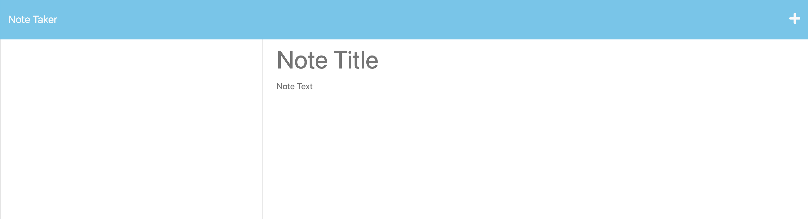

# ***Note Taker Application***

 

## Overview
This simple Application allows users to create, save, edit and delete notes, with content and titles of their choosing.

 

## Application Instructions
• To add notes, first click the "Get Started" button.
• On the next screen, enter your note's content and title by clicking the fields on the right.

• Click the  button to save a note.

• Once saved, your note will appear in the column to the left.

• To edit an existing note, click on it in column to the left and the note's content will reload in the fields to the right.

• Click the  button to add a new note.

 

## Screen-Caps of the Application

 

## Live Application Link
https://peaceful-garden-49558-8cba14d0f28d.herokuapp.com/notes

 

## Contributors To This Application
Kevin Lewis

 

# ***Thank you for using this App!***

 

## Questions? Contact the Developer on GitHub... 
KPL33
## ...or via Email
kevinsname2003@yahoo.com